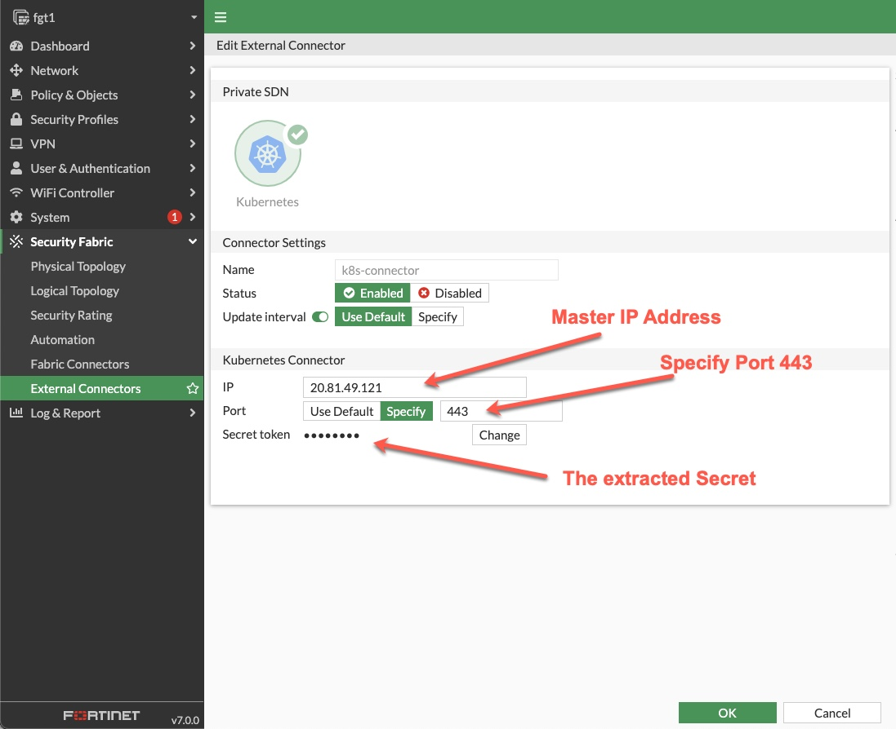
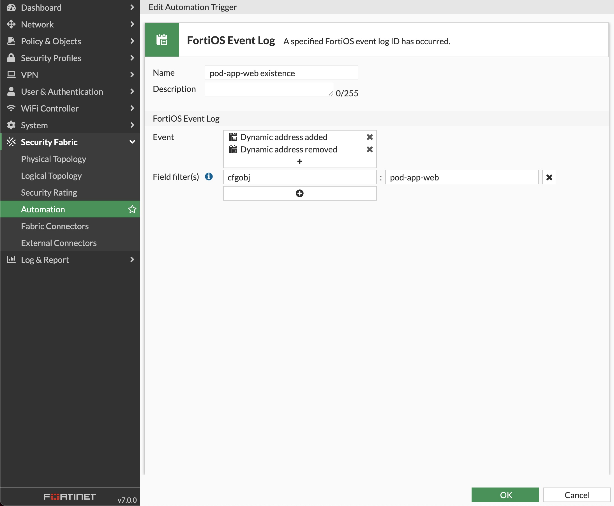
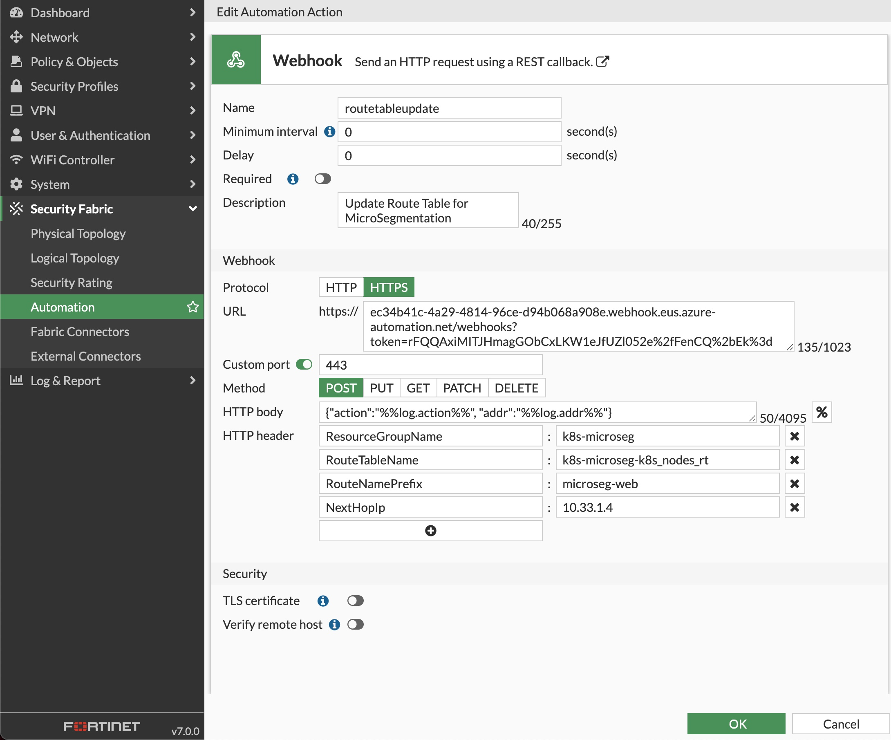
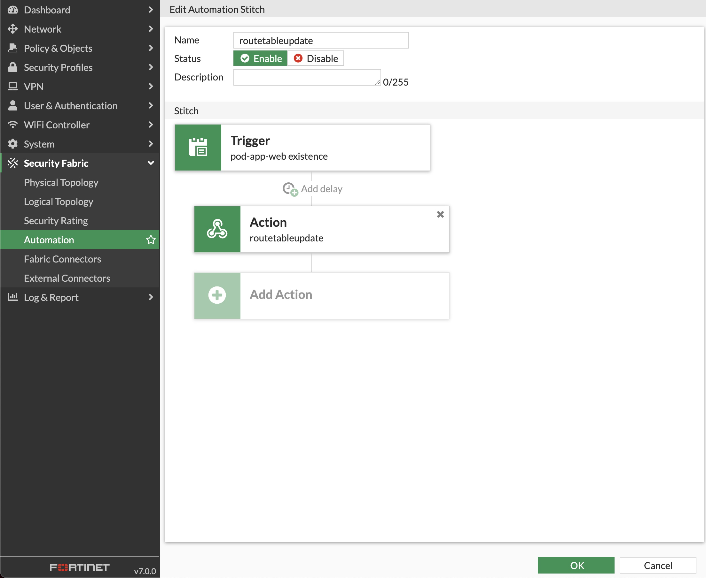

# Azure K8S Micro Segmentation Workshop

## Workshop main objectives

* Deploy a Kubernetes Cluster
* Deploy FortiGate Infrastructure
* Deploy Azure Automation
* Micro Segmentation of Kubernetes Pods with FortiGate Automation Stitches

## Chapter 1 - Preparation Steps [estimated duration 5min]

An Azure Account with a valid Subscription is required.

1. Open [Cloudshell](https://docs.microsoft.com/en-us/azure/cloud-shell/overview), commands in this lab are both bash and PowerShell, ensure that the PowerShell environment is selected.

1. Ensure the following tools are available in Azure Cloudshell, run each command to determine the version and ensure the command is available:

    * [Terraform](https://learn.hashicorp.com/tutorials/terraform/install-cli) - `terraform --version`
    * [kubectl](https://kubernetes.io/docs/tasks/tools/) - `kubectl version`
    * [git](https://git-scm.com/) - `git --version`

1. Get Subscription ID, if more than one Subscription is available Determine which subscription is currently the default Subscription. If necessary Select the desired Subscription.

    ```PowerShell
    Get-AzSubscription
    Get-AzContext
    Select-AzSubscription -Subscription <subscription_id>
    ```

## Chapter 2 - Create the environment [estimated duration 20min]

### Create the environment using the provided AKS Engine and Terraform code

1. Create a working directory and switch to it.

    ```bash
    mkdir Training
    cd Training
    ```

1. Clone the Github AzureMicroSeg repository to Cloudshell

    ```bash
    git clone https://github.com/fortinetsecdevops/AzureMicroSeg
    ```

    

1. Install the [aks-engine v0.64.0](https://github.com/Azure/aks-engine/releases/)

* The AKS Engine is a template-driven way to provision a self-managed Kubernetes cluster
* Download aks-engine and transfer the binary to the working directory

    ```bash
    cd AzureMicroSeg
    wget https://github.com/Azure/aks-engine/releases/download/v0.64.0/aks-engine-v0.64.0-linux-amd64.zip
    unzip aks-engine-v0.64.0-linux-amd64.zip
    mv aks-engine-v0.64.0-linux-amd64/aks-engine ./
    chmod +x aks-engine 
    ```

1. Use **Terraform** to deploy the FortiGate and Azure Networking

* Change to the directory Terraform

  ```bash
  cd Terraform
  ```

* Update the `terraform.tfvars` file, provide values for these variables. The easiest way to update the file is to use the Cloudshell editor.

  * azsubscriptionid = ""
  * project          = ""
  * TAG              = "k8s" <- This value does not have to change, shown for illustrative purposes

  >
  > The deployment Azure RESOURCE GROUP NAME  will be the combination of the *TAG* and *project* values
  >
  > For example, if the TAG value is **k8s** and the project value is **microseg**
  > the RESOURCE GROUP NAME will be **k8s-microseg**
  >

The `terraform.tfvars` file provides inputs for the resources that will be deployed.

1. Run `terraform init`
    * Initialize the Terraform environment, download required providers

1. Run `terraform validate`
    * Validate terraform files, references, variables, etc. If everything is valid, this message will be displayed
        **Success! The configuration is valid.**

1. Run `terraform plan`
    * Plan what objects will be created, updated, destroyed

1. Run `terraform apply`
    * Apply the terraform directives, terraform will ask for confirmation of the planned deployment, type `yes`

At the end of this step environment will be similar to the one pictured below


1. Deploy the Self-Managed Kubernetes cluster using **aks-engine**. A file customized to the deployment environment **WAS CREATED** by the Terraform process.
    * Deployment File - `AzureMicroSeg/Terraform/aks-calico-azure.json`
    * These values were read from the deployment environment and used to create the file. The file is generated from code in the network.tf file
        * SUBSCRIPTION_ID
        * RESOURCE_GROUP_NAME
        * VNET_NAME
        * MASTER_SUBNET_NAME
        * MASTER_IP_ADDRESS - this value is set to the 10th IP in the subnet for Master Nodes
        * ADMIN_USER_NAME

    > Many of the commands in this lab require the specification of a RESOURCE_GROUP_NAME
    > To make it easy to copy and paste the commands, set an environment variable to the RESOURCE_GROUP_NAME of the FortiGate and K8s deployment
    >
    > For example, for a deployment Resource Group named 'k8s-microseg' create an environment variable like this.
    >
    > $env:RESOURCE_GROUP_NAME='k8s-microseg'
    >

    ```bash
    cd ..
    ./aks-engine deploy --dns-prefix k8smicroseg --resource-group $env:RESOURCE_GROUP_NAME --location eastus --api-model ./Terraform/aks-calico-azure.json --auto-suffix
    ```

1. Verify that the deployment is successful by listing the K8S nodes. To access the cluster, copy the kubeconfig file that was generated during the previous step, to the ~/.kube directory.

    ```bash
    mkdir -pv ~/.kube
    cp  _output/k8smicroseg-RANDOM_ID/kubeconfig/kubeconfig.eastus.json ~/.kube/config
    kubectl get nodes -o wide
    ```

    

    At the end of this step the environment should be similar to below

    

1. Configure The [FortiGate K8S Connector](https://docs.fortinet.com/document/fortigate-private-cloud/7.0.0/kubernetes-administration-guide/718577) and verify that it is UP

* Run the following commands to enable the FortiGate Kubernetes Connector

  * Create a ServiceAccount for the FortiGate

    ```bash
    kubectl create serviceaccount fgt-svcaccount
    ```

  * Create a clusterrole

    ```bash
    kubectl apply -f ./K8S/fgt-k8s-connector.yaml
    ```

  * Create a clusterrolebinding

    ```bash
    kubectl create clusterrolebinding fgt-connector --clusterrole=fgt-connector --serviceaccount=default:fgt-svcaccount
    ```

  * Extract the ServiceAccount secret token and configure the FortiGate

    ```bash
    kubectl get secrets -o jsonpath="{.items[?(@.metadata.annotations['kubernetes\.io/service-account\.name']=='fgt-svcaccount')].data.token}"| base64 --decode
    ```

  * Setup the FortiGate Kubernetes Connector
    

1. Deploy two pods, one tagged with the label app=web and the other with the label app=db. Use the provided example web-db-deployment.yaml

    ```bash
    kubectl apply -f ./K8S/web-db-deployment.yaml
    ```

    

**************

1. Questions

    * Why did the aks-engine deployment create Load balancers?
    * Why was a UDP/1123 load balancing rule created on the Master LB?
    * How many PODs can the deployed Node accommodate?
    * What are the changes required to make the communication to the MasterNode go through the FortiGate?

**************

## Chapter 3 - Create the Azure Automation RunBook and Configure the FortiGate Automation Stitches [estimated duration 30min]

A FortiGate Automation Stitch brings together a trigger and an action. In this exercise the trigger is a log event and the action is the execution of a webhook.

* The trigger - a log event is generated when an IP address is added or removed from a dynamic address object
* The action - a webhook sends an HTTPS POST request to an endpoint in Azure. The endpoint runs a PowerShell script to update an Azure route table. The HTTP headers and JSON formatted body contain the information required to update the route table to manage micro-segmentation through the use of host routes. A host route is a route that indicates a specific host by using the IP-ADDRESS/32 in IPV4

This exercise covers the

* Setup of an Azure Automation Account
* Creation and Publishing of Azure Runbook
* Creation of Webhook to invoke Azure Runbook
* Creation of FortiGate Dynamic Address
* Creation of FortiGate Automation Stitch
* Creation of FortiGate Automation Stitch Trigger
* Creation of FortiGate Automation Stitch Action

### Part 1. Azure

Automation in Azure can be accomplished in a number of ways, Logic Apps, Function Apps, Runbooks, etc. Each of the automation methods can be triggered in a number of ways, Events, Webhooks, Schedules, etc.

This part of the exercise goes through the process of creating an Azure Automation account that enables the running of an Azure Runbook via a Webhook. An Azure Runbook is a PowerShell or Python script that the Automation Account can run. The actions the Runbook can perform are controlled by the rights and scope (where those actions can be performed) that have been granted to the Automation Account.

The **Actions** are contained in the PowerShell Modules that have been imported into the Automation Account. The PowerShell Modules are libraries of commands called Cmdlets that are grouped into several domains. For example, Accounts, Automation, Compute, Network, and Resources are the domains of the PowerShell Cmdlets used in the PowerShell code in this repository.

All of the steps can be performed in the Azure Portal. However, the commands shown in each section can be run directly in Azure Cloudshell. Cloudshell has all the required utilities to execute the commands. Nothing additional needs to be loaded on a personal device.

1. Azure Automation Account
    Create Automation Account [Automation Account](https://docs.microsoft.com/en-us/azure/automation/automation-create-standalone-account)

    1. Create an Automation Account in the Resource Group
        * Choose a Location
        * Provide a Name
        * Choose the Basic Plan
        * Indicate the assignment of a System Assigned Identity

    ```PowerShell
    New-AzAutomationAccount -ResourceGroupName $env:RESOURCE_GROUP_NAME -Location eastus -Name user-automation-01 -AssignSystemIdentity -Plan Basic
    ```

    1. Setup Automation Account [Managed Identity] (<https://docs.microsoft.com/en-us/azure/active-directory/managed-identities-azure-resources/overview>)

    ```PowerShell
    New-AzRoleAssignment -ObjectId (Get-AzAutomationAccount -ResourceGroupName $env:RESOURCE_GROUP_NAME -Name user-automation-01).Identity.PrincipalId -RoleDefinitionName "Contributor" -Scope (Get-AzResourceGroup -Name $env:RESOURCE_GROUP_NAME -Location eastus).ResourceId
    ```

1. Azure Automation Runbook
    1. Create, Import, and Publish Runbook - A Runbook is simply the PowerShell Code that runs in response to a trigger. Triggers can be manual, scheduled, and webhook.

    ```PowerShell
    New-AzAutomationRunbook -ResourceGroupName $env:RESOURCE_GROUP_NAME -AutomationAccountName user-automation-01 -Name ManageDynamicAddressRoutes -Type PowerShell
    
    Import-AzAutomationRunbook -ResourceGroupName $env:RESOURCE_GROUP_NAME -Name ManageDynamicAddressRoutes -AutomationAccountName user-automation-01 -Path ./Azure/ManageDynamicAddressRoutes.ps1 -Type PowerShell –Force
    
    Publish-AzAutomationRunbook -ResourceGroupName $env:RESOURCE_GROUP_NAME -AutomationAccountName user-automation-01 -Name ManageDynamicAddressRoutes
    ```

    1. Create Webhook

    ```PowerShell
    New-AzAutomationWebhook -ResourceGroupName $env:RESOURCE_GROUP_NAME -AutomationAccountName user-automation-01 -RunbookName ManageDynamicAddressRoutes -Name routetableupdate -IsEnabled $True -ExpiryTime "11/30/2022" -Force
    ```

    The output will include the URL of the enabled webhook. The webhook is only viewable at creation and cannot be retrieved afterwards. The output will look similar to below.

    ```text
    ResourceGroupName     : k8s-microseg
    AutomationAccountName : user-automation-01
    Name                  : routetableupdate
    CreationTime          : 11/13/2021 8:33:28 PM +00:00
    Description           :
    ExpiryTime            : 11/30/2022 12:00:00 AM +00:00
    IsEnabled             : True
    LastInvokedTime       : 1/1/0001 12:00:00 AM +00:00
    LastModifiedTime      : 11/13/2021 8:33:28 PM +00:00
    Parameters            : {}
    RunbookName           : ManageDynamicAddressRoutes
    WebhookURI            : https://f5f015ed-f566-483d-c972-0c2c3ca2a296.webhook.eus2.azure-automation.net/webhooks?token=P1GSd4Tasf5i1VYaVkFQvG29QCjkA8AOHY%2bsVLZOFSA%3d
    HybridWorker          :
    ```

### Part 2. FortiGate

1. FortiGate Dynamic Address
    * **Create** Dynamic Address to match a [***web*** pod](./FortiGate/address-pod-app-web.cfg)

        

    * **Repeat** the same for the [***db*** pod](./FortiGate/address-pod-app-db.cfg)

1. FortiGate Automation Stitch
    * **Create** [***web*** pod Trigger](./FortiGate/routetableupdate-trigger-web.cfg)
        * Log Address Added
        * Log Address Removed

        

    * Repeat the same for the [***db*** pod Trigger](./FortiGate/routetableupdate-trigger-db.cfg)

    * Create [***web*** pod Action](./FortiGate/routetableupdate-action-web.cfg)
        * Webhook <- Created in the Azure Automation setup
        * Body <- send the action (add or remove) and the IP address `{"action":"%%log.action%%", "addr":"%%log.addr%%"}`
        * Headers <- ResourceGroupName, RouteTableName, RouteNamePrefix, NextHopIp

        

    * Repeat for [***db*** pod Action](./FortiGate/routetableupdate-action-db.cfg)

    * Create [***web*** pod Stitch](./FortiGate/routetableupdate-stitch-web.cfg)
        * Trigger
        * Action
        

    * Repeat for [***db*** pod Stitch](./FortiGate/routetableupdate-stitch-db.cfg)

1. Delete the DB and Web pods to force their replacement. Check if the FGT detects an address change and triggers the automation Stich.
You can use the commands **diagnose debug  application autod -1** to debug the stitch.

    

1. Access the web POD, use curl and try to connect to the DB Pod from the web POD. Example below (replace POD name and IP address)

    ```bash
    kubectl get pods -o wide
    kubectl exec --tty --stdin web-deployment-66bf8c979c-ql2kn -- /bin/bash
    curl -v http://10.33.3.29:8080
    ```

    

**************

1. Questions

    * Is this setup secure? How is the runbook able to update the UDR without any authentication?
    * There is no policy that allows traffic between Web-pod and DB-pod on the FGT. Why is it allowed?  

**************

## Chapter 4 - Scale the deployment and taint the nodes [estimated duration 10min]

1. Scale the K8S cluster to two nodes

    ```bash
    ./aks-engine scale --resource-group $env:RESOURCE_GROUP_NAME --api-model  ./_output/k8smicroseg-RANDOM_ID/apimodel.json --new-node-count 2 --node-pool nodepool1 --apiserver  k8smicroseg-RANDOM_ID.eastus.cloudapp.azure.com --location eastus
    ```

    

1. Taint one node to receive Web pods only and the other one to receive DB pods (update with your own Node names)

    ```bash
    kubectl taint nodes k8s-nodepool1-20146942-0 app=web:NoSchedule
    kubectl taint nodes k8s-nodepool1-20146942-1 app=db:NoSchedule
    ```

1. Delete the previous deployments and create new ones with taint tolerations. You can use the provided example **web-db-deployment-tolerations.yaml**

    ```bash
    kubectl delete deployment db-deployment
    kubectl delete deployment web-deployment
    kubectl apply -f ./K8S/web-db-deployment-tolerations.yaml
    ```

    * Verify that the two pods are deployed in two different nodes. use the command **kubectl get pods -o wide**
    * Verify that the the route table has been updated accordingly

1. Access the web POD, install curl and try to connect to the DB Pod from the web POD.

**************

1. Questions

    * What is your conclusion ?

 **************
