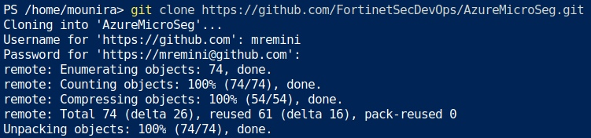
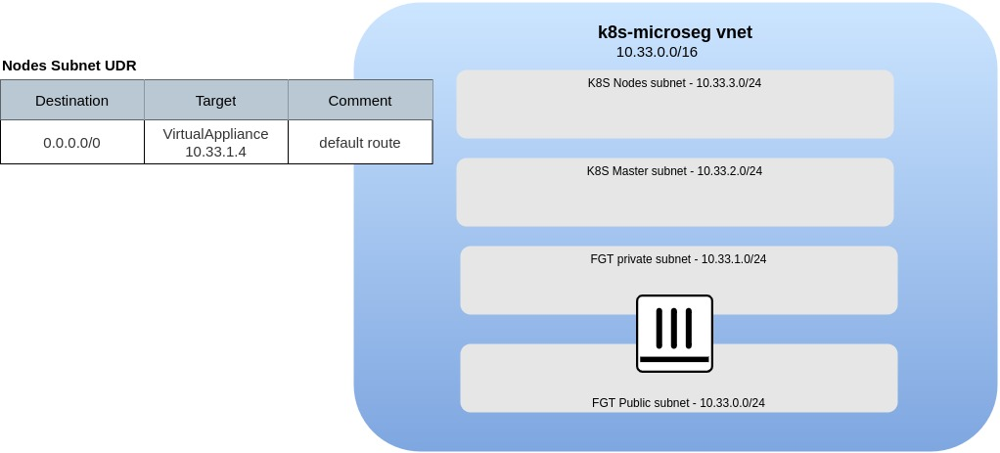

# Azure K8S Micro Segmentation Workshop

## Workshop main objectives

* Deploy a Kubernetes Cluster
* Deploy Azure Automation
* Micro Segmentation of Kubernetes Pods with FortiGate Automation Stitches

## Chapter 1 - Preparation Steps

1. Ensure you have the following tools available in your cloudshell:

    * An Azure account with a valid subscription
    * An Azure Cloudshell

    * Clone the repository in your cloud shell

     

    * download aks-engine v0.65.0, <https://github.com/Azure/aks-engine/releases/>

## Chapter 2 - Create the environment

1. Create the environment using the Terraform code provided. At the end of this step you should have an environment similar to the below



2. Deploy the Self-Managed cluster
3. Configure The FortiGate K8S Connector

    * Create a ServiceAccount for the FortiGate
    * Create a clusterrole
    * Create a clusterrolebinding
    * Extract the ServiceAccount secret token and configure the FortiGate

You can extract the secret token using the following command

```bash
kubectl get secret $(kubectl get serviceaccount fgt-svcaccount -o jsonpath='{range .secrets[*]}{.name}{"\n"}{end}' | grep token) -o go-template='{{.data.token | base64decode}}' && echo
```

4. Questions

## Chapter 3 - Create the RunBook and configure the FortiGate Automation Stitches

A FortiGate Automation Stitch brings together a trigger and an action. In this exercise the trigger is a log event and the action is the execution of a webhook.

* The trigger - a log event is generated when an IP address is added or removed from a dynamic address object
* The action - a webhook sends an HTTPS POST request to an endpoint in Azure. The endpoint runs a PowerShell script to update an Azure route table. The HTTP headers and JSON formatted body contain the information required to update the route table to manage micro-segmentation through the use of host routes. A host route is a route that indicates a specific host by using the IP-ADDRESS/32 in IPV4

This exercise covers the

* Setup of an Azure Automation Account
* Importing required Azure PowerShell Modules
* Creation and Publishing of Azure Runbook
* Creation of Webhook to invoke Azure Runbook
* Creation of FortiGate Dynamic Address
* Creation of FortiGate Automation Stitch
* Creation of FortiGate Automation Stitch Trigger
* Creation of FortiGate Automation Stitch Action

1. Azure Automation Account
    * Create Automation Account

        ```PowerShell
        New-AzResourceGroup -Name automation-01 -Location eastus2
        New-AzAutomationAccount -ResourceGroupName automation-01 -Location eastus2 -Name user-automation-01  -AssignSystemIdentity -Plan Basic
        ```

    * Setup Automation Account [Managed Identity] (<https://docs.microsoft.com/en-us/azure/active-directory/managed-identities-azure-resources/overview>)

        ```PowerShell
        New-AzRoleAssignment -ObjectId (Get-AzAutomationAccount -ResourceGroupName automation-01 -Name user-automation-01).Identity.PrincipalId -RoleDefinitionName "Contributor"
        ```

    * Import Az PowerShell Modules
        * Az.Accounts - This module needs to be imported first as the other modules have a dependency on it
        * Az.Automation
        * Az.Compute
        * Az.Network
        * Az.Resources

        ```PowerShell
        Import-AzAutomationModule -ResourceGroupName automation-01 -AutomationAccountName user-automation-01 -Name Az.Accounts  -ContentLinkUri https://www.powershellgallery.com/api/v2/package/Az.Accounts
        @("Automation","Compute","Network","Resources") | ForEach-Object {Import-AzAutomationModule -ResourceGroupName automation-01 -AutomationAccountName user-automation-01 -Name Az.$_  -ContentLinkUri https://www.powershellgallery.com/api/v2/package/Az.$_}
        ```

2. Azure Automation Runbook
    * Create, Import, and Publish Runbook

        ```PowerShell
        New-AzAutomationRunbook -ResourceGroupName automation-01 -AutomationAccountName user-automation-01 -Name ManageDynamicAddressRoutes -Type PowerShell
        Import-AzAutomationRunbook -Name ManageDynamicAddressRoutes -ResourceGroupName automation-01 -AutomationAccountName user-automation-01 -Path .\ManageDynamicAddressRoutes.ps1 -Type PowerShell –Force
        Publish-AzAutomationRunbook -ResourceGroupName automation-01 -AutomationAccountName user-automation-01 -Name ManageDynamicAddressRoutes
        ```

    * Create Webhook

        ```PowerShell
        New-AzAutomationWebhook -ResourceGroupName automation-01 -AutomationAccountName user-automation-01 -RunbookName ManageDynamicAddressRoutes -Name routetableupdate -IsEnabled $True -ExpiryTime "07/12/2022" -Force
        ```

        The output will include the URL of the enabled webhook. The webhook is only viewable at creation and cannot be retrieved afterwards. The output will look similar to below.

        ```text
        ResourceGroupName     : automation-01
        AutomationAccountName : user-automation-01
        Name                  : routetableupdate
        CreationTime          : 7/13/2021 8:33:28 PM +00:00
        Description           :
        ExpiryTime            : 7/12/2022 12:00:00 AM +00:00
        IsEnabled             : True
        LastInvokedTime       : 1/1/0001 12:00:00 AM +00:00
        LastModifiedTime      : 7/13/2021 8:33:28 PM +00:00
        Parameters            : {}
        RunbookName           : ManageDynamicAddressRoutes
        WebhookURI            : https://f5f015ed-f566-483d-c972-0c2c3ca2a296.webhook.eus2.azure-automation.net/webhooks?token=P1GSd4Tasf5i1VYaVkFQvG29QCjkA8AOHY%2bsVLZOFSA%3d
        HybridWorker          :
        ```

3. FortiGate Dynamic Address
    * Create Dynamic Address
        * Filter
4. FortiGate Automation Stitch
    * Trigger
        * Log Address Added
        * Log Address Removed
    * Action
        * Webhook
        * Body
        * Headers
    * Stitch
        * Trigger
        * Action

5. Questions
