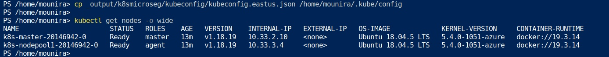
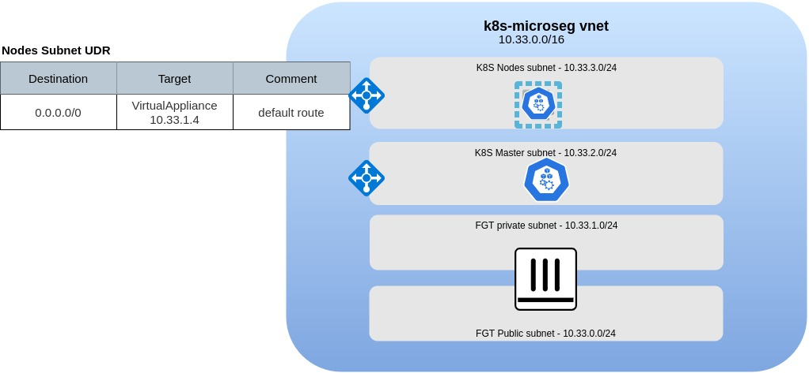
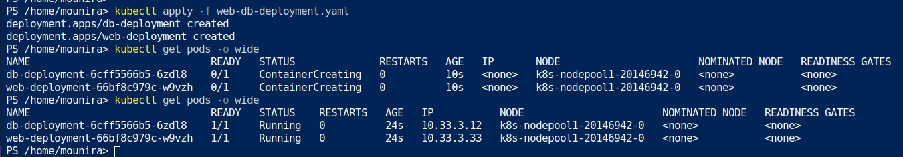
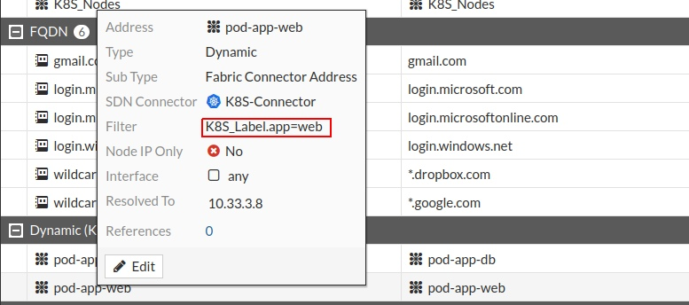
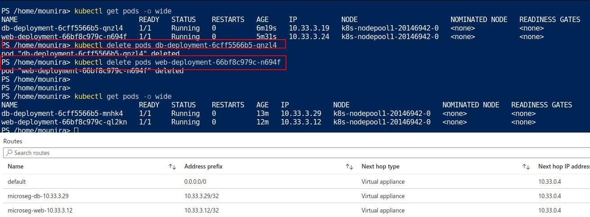
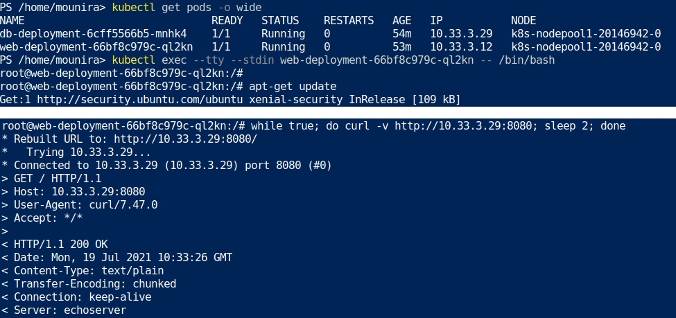
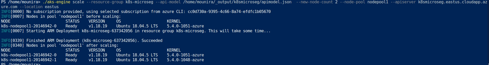

# Azure K8S Micro Segmentation Workshop

## Workshop main objectives

* Deploy a Kubernetes Cluster
* Deploy Azure Automation
* Micro Segmentation of Kubernetes Pods with FortiGate Automation Stitches

## Chapter 1 - Preparation Steps [estimated duration 5min]

1. Ensure you have the following tools available in your cloudshell:

    * Azure account with a valid subscription
    * Azure Cloudshell
    * Azure CLI,  <https://docs.microsoft.com/en-us/cli/azure/install-azure-cli>
    * Terraform, <https://learn.hashicorp.com/tutorials/terraform/install-cli>
    * kubectl,  <https://kubernetes.io/docs/tasks/tools/>
    * aks-engine v0.65.0, <https://github.com/Azure/aks-engine/releases/>

    * Clone the repository in your cloud shell

        

    * download aks-engine and transfer the binary to your home directory

        ```bash
        wget https://github.com/Azure/aks-engine/releases/download/v0.64.0/aks-engine-v0.64.0-linux-amd64.zip
        unzip aks-engine-v0.64.0-linux-amd64.zip
        mv aks-engine-v0.64.0-linux-amd64/aks-engine ./
        chmod +x aks-engine 
        ```

## Chapter 2 - Create the environment [estimated duration 20min]

1. Create the environment using the Terraform code provided. At the end of this step you should have an environment similar to the below


1. Deploy the Self-Managed cluster using aks-engine. Customize the deployment file to your own environment

    ```bash
    ./aks-engine deploy --resource-group k8s-microseg --location eastus --api-model ./AzureMicroSeg/K8S/aks-calico-azure.json
    ```

1. Verify that the deployment is successful by listing the K8S nodes. To access your cluster, transfer the kubeconfig file generated at the previous step to your kubeconfig directory

    ```bash
    cp  _output/k8smicroseg/kubeconfig/kubeconfig.eastus.json /home/mounira/.kube/config
    ```



At the end of this step you should have the following setup



1. Configure The FortiGate K8S Connector and verify that it's UP

    * Create a ServiceAccount for the FortiGate
    * Create a clusterrole
    * Create a clusterrolebinding
    * Extract the ServiceAccount secret token and configure the FortiGate

    You can extract the secret token using the following command

    ```bash
    kubectl get secrets -o jsonpath="{.items[?(@.metadata.annotations['kubernetes\.io/service-account\.name']=='fgt-svcaccount')].data.token}"| base64 --decode
    ```

1. Deploy two pods, one tagged with the label app=web and the other with the label app=db. You can use the provided example web-db-deployment.yaml



**************

1. Questions

    * Why the aks-engine deployment created Load balancers?
    * Why a UDP/1123 load balancing rule has been created on the Master LB?
    * How many PODs can the deployed Node accommodate?
    * If we want to make the communication to the MasterNode go through the FortiGate, what are the changes required ?

**************

## Chapter 3 - Create the RunBook and configure the FortiGate Automation Stitches [estimated duration 30min]

A FortiGate Automation Stitch brings together a trigger and an action. In this exercise the trigger is a log event and the action is the execution of a webhook.

* The trigger - a log event is generated when an IP address is added or removed from a dynamic address object
* The action - a webhook sends an HTTPS POST request to an endpoint in Azure. The endpoint runs a PowerShell script to update an Azure route table. The HTTP headers and JSON formatted body contain the information required to update the route table to manage micro-segmentation through the use of host routes. A host route is a route that indicates a specific host by using the IP-ADDRESS/32 in IPV4

This exercise covers the

* Setup of an Azure Automation Account
* Importing required Azure PowerShell Modules
* Creation and Publishing of Azure Runbook
* Creation of Webhook to invoke Azure Runbook
* Creation of FortiGate Dynamic Address
* Creation of FortiGate Automation Stitch
* Creation of FortiGate Automation Stitch Trigger
* Creation of FortiGate Automation Stitch Action

### Part 1. Azure

Automation in Azure can be accomplished in a number of ways, Logic Apps, Function Apps, Runbooks, etc. Each of the automation methods can be triggered in a number of ways, Events, Webhooks, Schedules, etc.

This part of the exercise goes through the process of creating an Azure Automation account that enables the running of an Azure Runbook via a Webhook. An Azure Runbook is just a PowerShell script that the Automation Account can run. The actions the Runbook can perform are controlled by the rights and scope (where those actions can be performed) that have been granted to the Automation Account.

The Actions come are contained in the PowerShell Modules that have been imported into the Automation Account. The PowerShell Modules are libraries of commands called Cmdlets that are grouped into several domains. For example, Accounts, Automation, Compute, Network, and Resources.

All of the steps can be performed in the Azure Portal. However the commands shown in each section can be run directly in Azure Cloudshell. Cloudshell has all the required utilities to execute the commands. Nothing additional needs to be loaded on a personal device.

1. Azure Automation Account
    * Create Automation Account [Automation Account](https://docs.microsoft.com/en-us/azure/automation/automation-create-standalone-account)

        1. Create a new Resource Group
        1. Create an Automation Account in the new Resource Group
            * Choose a Location
            * Provide a Name
            * Choose the Basic Plan
            * Indicate the assignment of a System Assigned Identity </br></br>

        ```PowerShell
        New-AzAutomationAccount -ResourceGroupName k8s-microseg -Location eastus -Name user-automation-01 -AssignSystemIdentity -Plan Basic
        ```

    * Setup Automation Account [Managed Identity] (<https://docs.microsoft.com/en-us/azure/active-directory/managed-identities-azure-resources/overview>)

        ```PowerShell
        New-AzRoleAssignment -ObjectId (Get-AzAutomationAccount -ResourceGroupName k8s-microseg -Name user-automation-01).Identity.PrincipalId -RoleDefinitionName "Contributor" -Scope (Get-AzResourceGroup -Name k8s-microseg -Location eastus).ResourceId
        ```

    * Import Az PowerShell Modules
        * Az.Accounts - This module needs to be imported first as the other modules have a dependency on it
        * Az.Automation
        * Az.Compute
        * Az.Network
        * Az.Resources

        ```PowerShell
        Import-AzAutomationModule -ResourceGroupName k8s-microseg -AutomationAccountName user-automation-01 -Name Az.Accounts  -ContentLinkUri https://www.powershellgallery.com/api/v2/package/Az.Accounts
        @("Automation","Compute","Network","Resources") | ForEach-Object {Import-AzAutomationModule -ResourceGroupName k8s-microseg -AutomationAccountName user-automation-01 -Name Az.$_  -ContentLinkUri https://www.powershellgallery.com/api/v2/package/Az.$_}
        ```

1. Azure Automation Runbook
    * Create, Import, and Publish Runbook

        ```PowerShell
        New-AzAutomationRunbook -ResourceGroupName k8s-microseg -AutomationAccountName user-automation-01 -Name ManageDynamicAddressRoutes -Type PowerShell
        
        Import-AzAutomationRunbook -Name ManageDynamicAddressRoutes -ResourceGroupName k8s-microseg -AutomationAccountName user-automation-01 -Path ./AzureMicroSeg/Azure/ManageDynamicAddressRoutes.ps1 -Type PowerShell –Force
        
        Publish-AzAutomationRunbook -ResourceGroupName k8s-microseg -AutomationAccountName user-automation-01 -Name ManageDynamicAddressRoutes
        ```

    * Create Webhook

        ```PowerShell
        New-AzAutomationWebhook -ResourceGroupName k8s-microseg -AutomationAccountName user-automation-01 -RunbookName ManageDynamicAddressRoutes -Name routetableupdate -IsEnabled $True -ExpiryTime "07/12/2022" -Force
        ```

        The output will include the URL of the enabled webhook. The webhook is only viewable at creation and cannot be retrieved afterwards. The output will look similar to below.

        ```text
        ResourceGroupName     : automation-01
        AutomationAccountName : user-automation-01
        Name                  : routetableupdate
        CreationTime          : 7/13/2021 8:33:28 PM +00:00
        Description           :
        ExpiryTime            : 7/12/2022 12:00:00 AM +00:00
        IsEnabled             : True
        LastInvokedTime       : 1/1/0001 12:00:00 AM +00:00
        LastModifiedTime      : 7/13/2021 8:33:28 PM +00:00
        Parameters            : {}
        RunbookName           : ManageDynamicAddressRoutes
        WebhookURI            : https://f5f015ed-f566-483d-c972-0c2c3ca2a296.webhook.eus2.azure-automation.net/webhooks?token=P1GSd4Tasf5i1VYaVkFQvG29QCjkA8AOHY%2bsVLZOFSA%3d
        HybridWorker          :
        ```

1. FortiGate Dynamic Address
    * Create Dynamic Address to match a Web pod
        

    * Repeat the same for the DB pod

    * Trigger
        * Log Address Added
        * Log Address Removed
    * Action
        * Webhook
        * Body
        * Headers
    * Stitch
        * Trigger
        * Action

1. FortiGate Automation Stitch

1. Delete the DB and Web pods to force their replacement. Check if the FGT detects an address change and triggers the automation Stich.
You can use the commands **diagnose debug  application autod -1** to debug the stich.



1. Access the web POD, install curl and try to connect to the DB Pod from the web POD. Example below (replace with your own POD name and ip address)

```bash
kubectl get pods -o wide
kubectl exec --tty --stdin web-deployment-66bf8c979c-ql2kn -- /bin/bash
apt-get update
apt-get install curl
while true; do curl -v http://10.33.3.29:8080; sleep 2; done;
```



**************

1. Questions

    * Is this setup secure? How is the runbook able to update the UDR without any authentication ?
    * There is no policy that allows traffic between Web-pod and DB-pod on the FGT. Why is it allowed?  

**************

## Chapter 4 - Scale the deployment and taint the nodes [estimated duration 10min]

1. Scale the K8S cluster to two nodes

    ```bash
    ./aks-engine scale --resource-group k8s-microseg --api-model /home/mounira/_output/k8smicroseg/apimodel.json  --new-node-count 2 --node-pool nodepool1 --apiserver  k8smicroseg.eastus.cloudapp.azure.com --location eastus
    ```



1. Taint one node to receive Web pods only and the other one to receive DB pods (update with your own Node names)

    ```bash
    kubectl taint nodes k8s-nodepool1-20146942-0 app=web:NoSchedule
    kubectl taint nodes k8s-nodepool1-20146942-1 app=db:NoSchedule
    ```

1. Delete the previous deployments and create new ones with taint tolerations. You can use the provided example **web-db-deployment-tolerations.yaml**

    ```bash
    kubectl delete deployment db-deployment
    kubectl delete deployment web-deployment
    kubectl apply -f web-db-deployment-tolerations.yaml
    ```

    * Verify that the two pods are deployed in two different nodes. use the command **kubectl get pods -o wide**
    * Verify that the the route table has been updated accordingly

1. Access the web POD, install curl and try to connect to the DB Pod from the web POD.

**************

1. Questions

    * What is your conclusion ?

 **************

## Chapter 5 [Optional] - Calico policy to control traffic inside the cluster
